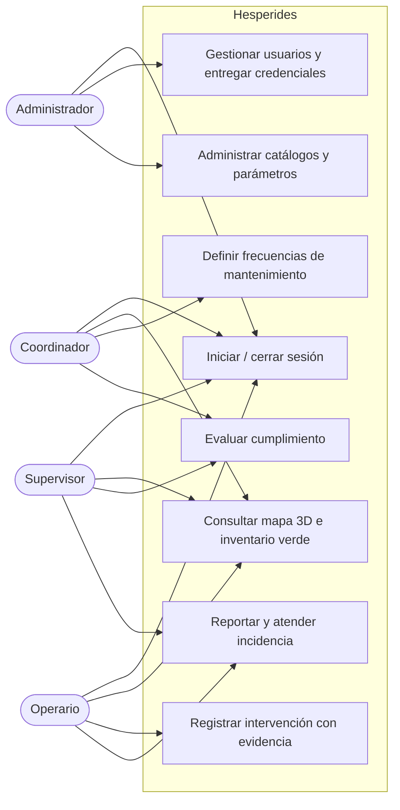
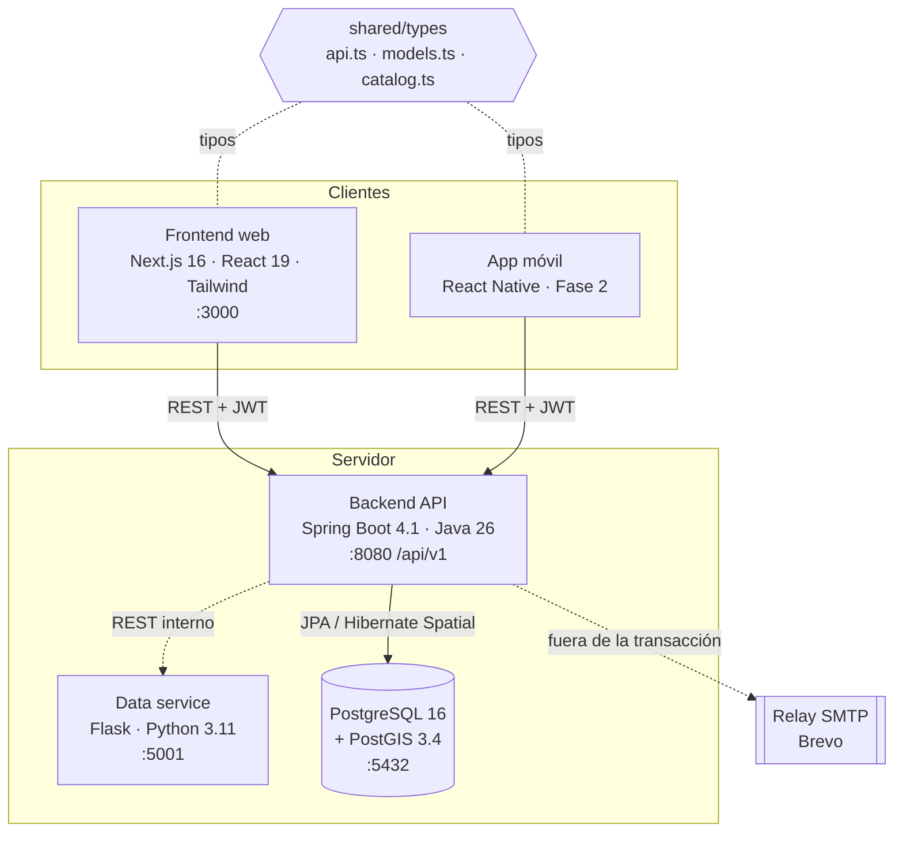
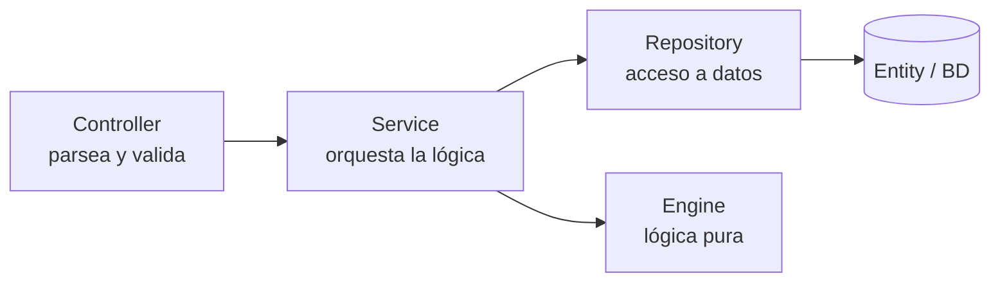
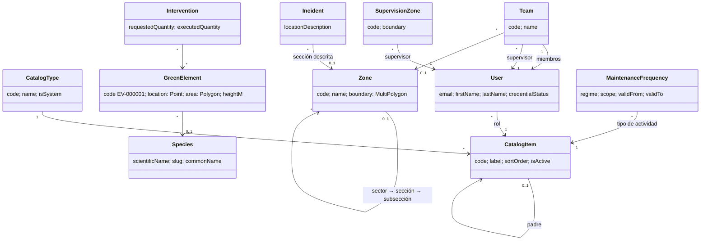
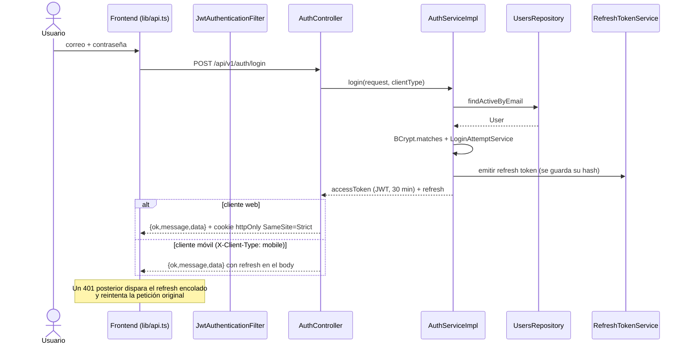
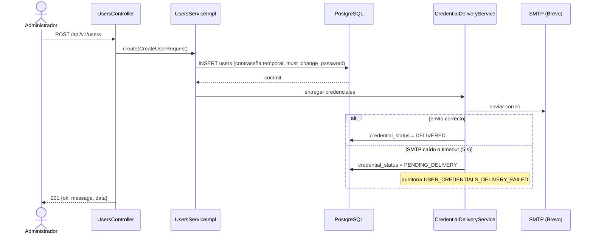

# Modelo de Análisis y Diseño (S6–S7)

> **Entregable de las semanas 6–7 (Sprint 3).** Describe cómo está construido Hesperides por
> dentro: qué problema resuelve, en qué piezas se divide y cómo se comunican. Refleja el estado
> del código en la rama `feature/mapa-interactivo` al 1 de octubre de 2026.
>
> **Documentos relacionados:** [Modelo de Base de Datos](../base-de-datos/README.md) ·
> [Modelo de Despliegue](../despliegue/README.md) ·
> [Estándares de codificación y CI/CD](../estandares-y-ci-cd/README.md)
>
> **Fuentes de verdad:** [`SPEC-000`](../../../specs/fundacionales/SPEC-000-arquitectura-general.md)
> (arquitectura), [`REGLAS.md`](../../../specs/REGLAS.md) (invariantes) y
> [`docs/dominio/README.md`](../../dominio/README.md) (negocio). Si este documento y un spec no
> coinciden, manda el spec.

---

## 1. Análisis del problema

### 1.1 Contexto

La Sección de Áreas Verdes y Medio Ambiente de la PUCP (DAF → OSG) mantiene **15.6 ha de áreas
verdes** y unos **3 500 árboles** en un campus de 41 ha, con un equipo de unas 30 personas. Hoy
la gestión vive en hojas de Excel repartidas en varios Drives que alimentan a mano un mapa
interactivo, y solo unos 1 000 árboles están ubicados.

Hesperides reemplaza ese flujo por un sistema único que:

- georreferencia el **catastro verde** (ejemplares, especies, secciones del campus),
- registra las **intervenciones** de mantenimiento (riego, poda, corte de césped, fitosanitario…),
- controla el **cumplimiento de frecuencias** pactadas o declaradas,
- recibe y atiende **incidencias** del campus,
- distingue los **dos regímenes de trabajo**: personal estable PUCP y servicios tercerizados.

### 1.2 Actores

Los roles no son un `enum`: son filas del catálogo `ROLE` (SPEC-003), sembradas en el baseline.

| Rol (`code`) | Etiqueta | Qué hace en el sistema |
|---|---|---|
| `ADMIN` | Administrador | Alta de usuarios, catálogos, parámetros del sistema |
| `COORDINADOR` | Coordinador | Planifica, revisa cumplimiento, consulta todo el campus |
| `SUPERVISOR` | Supervisor de cuadrilla | Gestiona su cuadrilla y su zona de supervisión |
| `OPERARIO` | Operario de campo | Registra intervenciones y evidencias desde el campo |

La matriz completa de permisos por endpoint está en el **Anexo A de SPEC-001** (INV-5) y no se
reinterpreta en ningún otro spec.

### 1.3 Módulos funcionales

| Módulo | Spec | Estado |
|---|---|---|
| Autenticación y sesiones | SPEC-001 | ✅ Implementado |
| Gestión de usuarios y cuadrillas | SPEC-100 | ✅ Implementado (en revisión) |
| Catálogos configurables | SPEC-003 | ✅ Implementado (en revisión) |
| Parámetros del sistema | SPEC-002 §4.9 | ✅ Implementado |
| Frecuencias de mantenimiento | SPEC-101 | 🔄 En progreso |
| Mapa 3D del campus | SPEC-102 | 🔄 En progreso |
| Inventario verde (catastro) | SPEC-002 §4.4–4.5 | 🔄 En progreso |
| Intervenciones, contratos, incidencias, reportes | SPEC-002 §4.6–4.8 | ⏳ Diseñado, sin implementar |

### 1.4 Casos de uso principales



### 1.5 Requisitos no funcionales que condicionan el diseño

| Requisito | Decisión de diseño que provoca |
|---|---|
| **Extensible a otros clientes** | Catálogos en BD en vez de enums; nada de «PUCP» en la lógica (INV-2, INV-9) |
| **Trazabilidad** | Soft delete en toda tabla y auditoría de acciones sensibles (SPEC-004) |
| **Dependencias externas acotadas** | Solo SMTP, publicación en el mapa del cliente y servicio de mapas; su caída nunca bloquea una operación de negocio (REGLAS §0.1) |
| **Web y móvil con la misma API** | Una sola API REST; la sesión se adapta por cabecera `X-Client-Type` |
| **Cobertura irregular en el campus** | Evidencias con subida diferida e idempotente (`uploaded_at`, `client_reference`) |
| **Verificable por no expertos** | Cada feature nace de un spec con criterios de aceptación comprobables sin leer código |

---

## 2. Arquitectura del sistema

### 2.1 Vista de componentes

Monorepo con tres servicios desplegables y un paquete de tipos compartidos:



| Componente | Responsabilidad |
|---|---|
| **Frontend web** | Interfaz de navegador. Consume la API solo a través de `lib/api.ts` |
| **App móvil** | Fase 2. Misma API, sesión guardada en SecureStore |
| **Backend** | API Gateway y dueño de todas las reglas de negocio |
| **Data service** | Procesamiento de datos especializado. Hoy solo expone `/health` |
| **PostgreSQL + PostGIS** | Persistencia relacional y geométrica (catastro, zonas, edificios) |
| **`shared/types`** | Contratos TypeScript comunes a web y móvil |

### 2.2 Arquitectura en capas del backend

Flujo unidireccional estricto. El Engine es puro: no conoce Spring, JPA ni I/O.



| Capa | Paquete | Regla |
|---|---|---|
| Controller | `modules/<m>/controller` | Parsea, valida con Bean Validation, delega. Sin lógica de negocio (INV-6) |
| DTO | `modules/<m>/dto` | `XxxRequest` / `XxxResponse`; nunca se expone una `@Entity` |
| Service | `modules/<m>/service` | Interfaz + `Impl`, en plural (`UsersService`, `UsersServiceImpl`) |
| Repository | `modules/<m>/repository` | Spring Data JPA, plural (`UsersRepository`) |
| Entity | `modules/<m>/entity` | Extiende `BaseEntity` (INV-3) |
| Engine | `engine/<dominio>` | Funciones puras, testeables sin contexto de Spring |
| Shared | `shared/*` | Seguridad, excepciones, auditoría, `BaseEntity` |

### 2.3 Paquetes del backend

```
pe.edu.pucp.hesperides
├── config/              HealthController
├── modules/
│   ├── auth/            login, refresh, logout, sesión (SPEC-001)
│   ├── users/           usuarios, cuadrillas, entrega de credenciales (SPEC-100)
│   ├── catalogs/        tipos e ítems de catálogo (SPEC-003)
│   ├── admin/           parámetros del sistema y política de contraseñas
│   ├── maintenance/     frecuencias y cumplimiento (SPEC-101)
│   ├── map/             capas del mapa y descripción de ubicaciones (SPEC-102)
│   └── inventory/       especies y ejemplares del inventario verde
├── engine/
│   ├── frequency/       evaluadores de cumplimiento (intervalo, cuota anual, estacional)
│   └── proximity/       geometría plana y «¿dónde está esto?» en lenguaje natural
└── shared/
    ├── entity/          BaseEntity (id, timestamps, deleted_at)
    ├── security/        JWT, filtros, CORS, SecurityConfig
    ├── exception/       ApiResponse, excepciones tipadas, GlobalExceptionHandler
    └── audit/           AuditService, códigos de acción
```

### 2.4 Estructura del frontend

```
frontend/src/
├── app/                      App Router de Next.js
│   ├── login/                inicio de sesión
│   ├── cambiar-password/     cambio obligatorio en el primer ingreso
│   ├── (dashboard)/          rutas con sesión: guard + sidebar una sola vez
│   │   ├── admin/            usuarios, catálogos, parámetros
│   │   └── mapa/             visor 3D del campus
│   ├── inventario-verde/     especies y ejemplares
│   └── embed/mapa/           mapa embebible
├── components/               ui · forms · layouts · un directorio por módulo
├── hooks/                    useAuth, useCatalog, useUsers, useMapLayers…
└── lib/                      api.ts (cliente HTTP único) + un *-api.ts por módulo
```

---

## 3. Diseño detallado

### 3.1 Modelo de dominio (vista conceptual)

Vista de análisis: entidades del negocio y sus relaciones. El esquema físico, con tipos e
índices, está en el [Modelo de Base de Datos](../base-de-datos/README.md).



**Decisiones de modelado relevantes:**

- **Todo tipo, estado o rol es un `CatalogItem`.** Añadir un tipo de intervención es insertar
  una fila, no recompilar. Los catálogos admiten dos niveles (`parent_item_id`): 9 clases de
  intervención agrupan 45 tipos.
- **`GreenElement` no guarda su sección.** Se calcula por posición, porque un tercio del
  catastro está en veredas y plazas fuera de toda sección, y una sección redibujada dejaría
  desactualizado lo guardado.
- **`Zone` es jerárquica** (sector → sección → subsección) y su contorno es `MultiPolygon`: un
  sector es la suma de áreas repartidas por el campus.
- **Las frecuencias se versionan** con `valid_from`/`valid_to` en vez de sobrescribirse: relajar
  una tolerancia cambia qué cuenta como incumplimiento y debe quedar rastro.

### 3.2 Secuencia: inicio de sesión (SPEC-001)



### 3.3 Secuencia: alta de usuario con entrega de credenciales (SPEC-100)

El envío de correo ocurre **fuera** de la transacción: si el SMTP cae, el alta se guarda igual
y la cuenta queda en `PENDING_DELIVERY` para que el administrador reenvíe.



### 3.4 Engine: evaluación de cumplimiento de frecuencias

`engine/frequency` decide si una actividad se cumplió sin tocar la base de datos.
`FrequencyEvaluator` solo despacha según el código del catálogo `FREQUENCY_RULE_TYPE`; cada
familia de reglas tiene su evaluador. Por eso ese catálogo es `is_system`: un código sembrado
desde la pantalla de catálogos sería una opción que ningún evaluador sabe calcular, y el
despachador falla con un error explícito.

| Código de regla | Evaluador | Qué comprueba |
|---|---|---|
| `INTERVAL_DAYS` | `IntervalEvaluator` | Días entre ejecuciones dentro de `[min, max]` («campus completo cada 15 días») |
| `COVERAGE_CYCLE` | `IntervalEvaluator` | Días para cubrir el 100 % del ámbito |
| `SEASONAL_PERIOD` | `AnnualCountEvaluator` | Cuota de ejecuciones dentro de la temporada |
| `ANNUAL_WINDOW` | `AnnualCountEvaluator` | Cuota anual dentro de una ventana |
| `ON_DEMAND` | — | No aplica: la actividad es reactiva |

El servicio (`MaintenanceFrequenciesServiceImpl`) obtiene las fechas de ejecución a través de la
abstracción `ExecutionHistoryProvider` y se las pasa ya cargadas al Engine, que devuelve un
`ComplianceResult`.

### 3.5 Engine: descripción de ubicaciones

`engine/proximity` traduce una coordenada a texto («a 12 m al norte del Pabellón H, en la
sección AV-0151»). Proyecta a un plano local (`LocalPlane`) para medir en metros y usa umbrales
de cercanía fijados como constantes del Engine (`ProximityThresholds`), expuestos como
parámetros de solo lectura (SPEC-102 D-04). La descripción se calcula al registrar una incidencia
y queda congelada.

### 3.6 Patrones aplicados

| Patrón | Dónde | Por qué |
|---|---|---|
| **Repository** | `modules/*/repository` | Desacopla negocio del ORM |
| **Service delgado** | `modules/*/service` | Valida reglas, delega, persiste, devuelve |
| **Despachador + evaluadores** | `engine/frequency` | Un evaluador por familia de reglas; añadir una no toca las existentes |
| **Error handler global** | `GlobalExceptionHandler` | Traduce excepciones tipadas a 400/401/404/409/422/429/500 (el 403 lo emite `RestAccessDeniedHandler`) |
| **Sobre de respuesta** | `ApiResponse<T>` | `{ok, message, data}` en toda respuesta, incluido Flask (INV-1) |
| **Adaptador de proveedor** | `CredentialDeliverer`, `ExecutionHistoryProvider` | Ningún servicio conoce al proveedor concreto (REGLAS §0.1) |
| **Soft delete** | `BaseEntity` + `@SQLRestriction` | Nada se borra; las consultas excluyen lo borrado sin repetirlo |

### 3.7 Contrato de la API

- Base: `/api/v1`. Autenticación por `Authorization: Bearer <JWT>`.
- Sobre único:

  ```json
  { "ok": true, "message": "Operación exitosa", "data": { } }
  ```

- El código HTTP acompaña al sobre; nunca se responde 200 con un error.
- La geometría viaja como **GeoJSON** en orden longitud-latitud.
- Toda referencia a catálogo se serializa como `{ id, code, label }`.
- Los listados que puedan superar 20 filas se paginan con `?page=&size=&sort=`.

---

## 4. Trazabilidad de decisiones

| Decisión | Dónde se tomó |
|---|---|
| Catálogos en lugar de enums | SPEC-003 |
| Tres excepciones a «sin servicios externos» | SPEC-100, SPEC-005 → REGLAS §0.1 |
| Visor 3D (Three.js) en lugar de Leaflet | SPEC-102 → SPEC-C01 §6 |
| Sin `zone_id` en `green_elements` | Inventario verde, 1 oct 2026 |
| Spring Boot 4 / Java 26 | SPEC-000, versiones verificadas en el `pom` |

El historial completo de enmiendas está en [`specs/REGISTRO.md`](../../../specs/REGISTRO.md).
