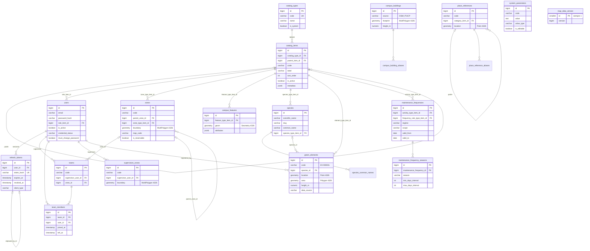

# Modelo de Base de Datos (S6–S7)

> **Entregable de las semanas 6–7 (Sprint 3).** Describe el esquema físico de Hesperides: motor,
> tablas, relaciones, índices, convenciones y cómo evoluciona. Refleja las migraciones
> `V001`–`V014` aplicadas al 1 de octubre de 2026.
>
> **Documentos relacionados:** [Modelo de Análisis y Diseño](../analisis-y-diseno/README.md) ·
> [Modelo de Despliegue](../despliegue/README.md) ·
> [Estándares de codificación y CI/CD](../estandares-y-ci-cd/README.md)
>
> **Fuentes de verdad:** las migraciones en
> [`backend/src/main/resources/db/migration/`](../../../backend/src/main/resources/db/migration/)
> y [`SPEC-002`](../../../specs/fundacionales/SPEC-002-modelo-datos.md). El
> [mapa de migraciones de `REGISTRO.md`](../../../specs/REGISTRO.md#mapa-de-migraciones) es la
> fuente única de qué número tiene cada migración.

---

## 1. Tecnología

| Elemento | Elección | Motivo |
|---|---|---|
| Motor | **PostgreSQL 16** | Relacional, maduro, índices parciales y `JSONB` |
| Extensión espacial | **PostGIS 3.4** (`postgis/postgis:16-3.4`) | El catastro y las zonas son geometrías |
| Extensión de texto | `unaccent` | Búsquedas que ignoran tildes («jardin» encuentra «jardín») |
| Sistema de referencia | **EPSG:4326** (WGS 84, lon/lat) | Es el que usan GeoJSON, OSM y el mapa del cliente |
| ORM | Hibernate / JPA + **Hibernate Spatial** (JTS) | Mapea `GEOMETRY` a `Point`, `Polygon`, `MultiPolygon` |
| Migraciones | **Flyway** (`spring-boot-starter-flyway`) | Esquema versionado; `ddl-auto: validate`, nunca `update` |
| Pool de conexiones | HikariCP | El que trae Spring Boot por defecto |

---

## 2. Convenciones del esquema

Toda tabla de dominio cumple estas reglas (REGLAS §5.4, INV-3, INV-4):

| Regla | Detalle |
|---|---|
| Nombres | Tablas en `snake_case` plural (`green_elements`); columnas en `snake_case` |
| Clave primaria | `id BIGSERIAL` |
| Auditoría temporal | `created_at` y `updated_at` `NOT NULL DEFAULT CURRENT_TIMESTAMP` |
| **Soft delete** | `deleted_at TIMESTAMP NULL`. `NULL` = vigente. **Nunca se ejecuta `DELETE`** |
| Unicidad | Índices únicos **parciales** `WHERE deleted_at IS NULL`, para poder reutilizar un código liberado |
| Catálogos | Toda FK a catálogo se llama `<concepto>_item_id` y apunta a `catalog_items(id)` |
| Claves foráneas | `ON DELETE RESTRICT` implícito: nada se borra en cascada porque nada se borra |
| Índices | `idx_<tabla>_<columnas>`; `GIST` en toda columna geométrica |
| Reglas locales | `CHECK` con nombre (`chk_<tabla>_<regla>`) para lo que se valida dentro de una fila |

En Java estas columnas no se repiten: toda entidad extiende `BaseEntity` (`@MappedSuperclass`)
y añade `@SQLRestriction("deleted_at IS NULL")` para que Hibernate excluya lo borrado.

> **Por qué hay valores con `CHECK` en lugar de catálogo.** Algunos estados son de sistema y
> tienen lógica asociada que no puede cambiar desde la interfaz (`credential_status`,
> `regime`, `scope`, `data_source`). Lo que el cliente puede querer ampliar —tipos, roles,
> categorías— va siempre a `catalog_items` (SPEC-003).

---

## 3. Diagrama entidad-relación

Tablas aplicadas en `V001`–`V014`. Las columnas de auditoría (`created_at`, `updated_at`,
`deleted_at`) se omiten para no repetirlas en cada caja.



---

## 4. Diccionario de tablas

Agrupadas por área funcional.

### 4.1 Catálogos configurables (SPEC-003)

| Tabla | Propósito | Notas de diseño |
|---|---|---|
| `catalog_types` | Cada lista configurable (`ROLE`, `ZONE_TYPE`…) | `is_system = TRUE` impide crear ítems desde la interfaz cuando el código tiene lógica asociada |
| `catalog_items` | Los valores de cada lista | Jerarquía de **dos niveles** por `parent_item_id` (9 clases de intervención → 45 tipos). `UNIQUE (catalog_type_id, code)`. `metadata JSONB` para atributos propios de un catálogo |

Catálogos sembrados hoy: `ROLE`, `INTERVENTION_CLASS`, `INTERVENTION_TYPE`,
`FREQUENCY_RULE_TYPE`, `ZONE_TYPE`, `USE_TYPE`, `LANDSCAPE_TYPE`, `IRRIGATION_CURRENT`,
`IRRIGATION_PROJECT`, `RESERVATION_OWNER`, `REFERENCE_CATEGORY`, `BUILDING_CATEGORY`,
`FEATURE_TYPE`, `SPECIES_TYPE`, `SPECIES_ORIGIN`, `GREEN_ELEMENT_TYPE`, `ELEMENT_CONDITION`.

### 4.2 Identidad y organización (SPEC-001, SPEC-100)

| Tabla | Propósito | Notas de diseño |
|---|---|---|
| `users` | Cuentas del sistema | Correo único **entre vigentes**. `credential_status` (`PENDING_DELIVERY`/`DELIVERED`) es independiente de `is_active`. `must_change_password` fuerza el cambio en el primer ingreso |
| `refresh_tokens` | Sesiones revocables | Se guarda el **hash**, nunca el token. `replaced_by_id` encadena la rotación. Un JWT firmado no se puede borrar; cerrar sesión de verdad vive aquí |
| `teams` | Cuadrillas | Un supervisor por cuadrilla; zona opcional (una cuadrilla puede ser polivalente) |
| `team_members` | Pertenencia con historia | `left_at` conserva quién estuvo en qué cuadrilla cuando se ejecutó un trabajo pasado |
| `system_parameters` | Parámetros editables | `value_type` tipa el valor (`STRING`, `INTEGER`, `DECIMAL`, `BOOLEAN`, `JSON`) |

### 4.3 Territorio y mapa (SPEC-102, SPEC-005)

| Tabla | Propósito | Notas de diseño |
|---|---|---|
| `zones` | Jerarquía **sector → sección → subsección** | `boundary MultiPolygon`: un sector es la suma de áreas dispersas. `map_code` no es único (el mapa del cliente repite códigos). Un jardín reservable siempre declara dueño (`CHECK`) |
| `supervision_zones` | Capa territorial del supervisor | Fuera de la jerarquía: cada zona corta varios sectores. La geometría es obligatoria |
| `place_references` / `_aliases` | Lugares con nombre que usa el personal | Punto + categoría; los alias permiten buscar por nombre coloquial |
| `campus_buildings` / `_aliases` | Edificios para el visor 3D | `source` = `OSM` o `PUCP`; altura y niveles para extruir |
| `campus_features` | Mobiliario visible en el mapa (tachos, puertas…) | Geometría genérica + `attributes JSONB`. Un tipo que gane reglas propias se promueve a su tabla |
| `map_data_version` | Contador de versión de las capas | Fila única (`CHECK id = 1`). Lo incrementan **triggers por sentencia** sobre las siete tablas del mapa, así el visor sabe si debe volver a descargar |

### 4.4 Inventario verde (catastro)

| Tabla | Propósito | Notas de diseño |
|---|---|---|
| `species` | Especies botánicas | Nombre científico y `slug` únicos entre vigentes; el `slug` va en la URL de la ficha porque los `id` cambian en cada recarga |
| `species_common_names` | Nombres coloquiales alternativos | Se encuentran al buscar |
| `green_elements` | Ejemplares o agrupaciones | Código propio `EV-000001` generado por secuencia (va en el QR). **Sin `zone_id`**: la sección se calcula por posición. Exige punto **o** polígono. Las medidas guardan su procedencia (`MEASURED`/`GENERIC`/`UNKNOWN`) y una altura no puede tener procedencia `UNKNOWN` |

### 4.5 Mantenimiento (SPEC-101)

| Tabla | Propósito | Notas de diseño |
|---|---|---|
| `maintenance_frequencies` | Regla de frecuencia por tipo de actividad | `regime` (`IN_HOUSE`/`OUTSOURCED`), `scope` (`CAMPUS_WIDE`/`BY_SECTOR`/`BY_ZONE`). **Versionada** por `valid_from`/`valid_to`: relajar una tolerancia crea una versión nueva. Siete `CHECK` validan la coherencia del intervalo, la temporada y la vigencia |
| `maintenance_frequency_seasons` | Intervalo distinto por estación | Una fila por estación y frecuencia (`UNIQUE`). Es la única FK con `ON DELETE CASCADE`: la temporada no existe sin su regla |

### 4.6 Tablas diseñadas pendientes de migración

Definidas en SPEC-002 y reservadas en el mapa de migraciones, sin aplicar todavía:

| Área | Tablas | Spec |
|---|---|---|
| Intervenciones | `interventions`, `intervention_elements`, `intervention_supplies`, `intervention_evidences` | SPEC-002 §4.6 |
| Contratos | `providers`, `contracts`, `contract_zones`, `contract_executions` | SPEC-002 §4.7 |
| Incidencias | `incidents`, `incident_status_history`, `incident_evidences` | SPEC-002 §4.8 |
| Auditoría | `audit_log` (append-only, sin `updated_at` ni `deleted_at`) | SPEC-004 |

Hoy la auditoría se emite por log estructurado (`LoggingAuditService`) hasta que exista la tabla.

---

## 5. Índices

| Tipo | Uso | Ejemplos |
|---|---|---|
| **Único parcial** | Unicidad que convive con soft delete | `idx_users_email_active`, `idx_zones_code_active`, `idx_species_slug_active` |
| **GIST** | Consultas espaciales (contiene, intersecta, cercanía) | `idx_zones_boundary`, `idx_green_elements_location`, `idx_campus_buildings_footprint` |
| **B-tree en FK** | Joins y filtros por catálogo o dueño | `idx_users_role_item_id`, `idx_green_elements_species_id` |
| **Parcial de filtro** | Acelerar un listado concreto | `idx_users_credential_status WHERE credential_status = 'PENDING_DELIVERY'` |
| **Compuesto** | Listado por defecto | `idx_users_is_active_role (is_active, role_item_id)` |

---

## 6. Migraciones

| Versión | Archivo | Contenido |
|---|---|---|
| V001 | `baseline_schema` | `unaccent`, catálogos, roles, `users`, `refresh_tokens`, cuenta admin inicial, cuadrillas, taxonomía de intervenciones |
| V002 | `create_maintenance_frequencies` | Frecuencias y temporadas (SPEC-101) |
| V003 | `create_system_parameters` | Parámetros del sistema |
| V004 | `enable_postgis` | `CREATE EXTENSION postgis` |
| V005 | `create_zones` | Zonas jerárquicas; añade la FK pendiente `teams.zone_id` |
| V006 | `create_supervision_zones` | Zonas de supervisión |
| V007 | `create_place_references` | Referencias y alias |
| V008 | `create_campus_buildings` | Edificios y alias |
| V009 | `create_campus_features` | Mobiliario del campus |
| V010 | `create_map_data_version` | Contador de versión y sus triggers |
| V011 | `seed_map_data` | **Generada**: 5 sectores, secciones, zonas de supervisión, referencias, edificios OSM y mobiliario |
| V012 | `create_species` | Especies y nombres comunes |
| V013 | `create_green_elements` | Ejemplares del catastro |
| V014 | `seed_green_inventory` | **Generada**: especies y ejemplares del catastro |

### 6.1 Reglas de numeración (REGLAS §0.2)

- **Cronológica y sin huecos.** Una migración nueva toma el siguiente número libre y va al
  final. El número dice *cuándo* se escribió, no a quién pertenece; la spec propietaria se
  declara en el comentario de cabecera del archivo.
- **Nunca se reescribe ni se renumera una migración publicada.** Flyway guarda su checksum:
  cambiarla rompe el arranque de toda base que ya la aplicó.
- `spring.flyway.out-of-order` se mantiene en `false`. `MigrationNumberingTest` vigila la
  invariante en cada build.
- **Las semillas generadas no se editan a mano.** `V011` la produce
  `scripts/mapa/generar_semilla_mapa.py` y `V014` `scripts/catastro/generar_semilla_catastro.py`,
  ambas desde `docs/dominio/datos/`. Para cambiar un dato se corrige la fuente y se regenera.
- `V004` debe correr antes que cualquier tabla con `GEOMETRY`. Sobre una imagen sin PostGIS
  falla a propósito (fail fast).

---

## 7. Integridad y seguridad de los datos

| Aspecto | Cómo se garantiza |
|---|---|
| Contraseñas | Solo hash BCrypt (`password_hash`); nunca en logs (INV-8) |
| Tokens de sesión | Solo hash (`token_hash`); revocación por `revoked_at` |
| Cuenta inicial | `admin@pucp.edu.pe` con contraseña pública en el repo: **debe cambiarse** en el primer ingreso de cualquier despliegue real |
| SQL | JPA o consultas parametrizadas; nunca concatenación (INV-7) |
| Reglas entre filas | Las valida el servicio (p. ej. que el padre de un ítem sea de otro tipo, que el supervisor tenga rol válido): un `CHECK` no puede consultar otra fila |
| Datos inventados | No se siembran valores de ejemplo: un dato inventado es indistinguible de uno real para el equipo |
| Atribución | Contornos y alturas de edificios © colaboradores de OpenStreetMap (ODbL) |

---

## 8. Cómo inspeccionar la base en local

```bash
# Levanta la BD expuesta en el puerto 5432 del host (solo con el override dev)
docker compose -f docker-compose.yml -f docker-compose.dev.yml up -d db

# Consola SQL
docker exec -it hesperides-db psql -U hesperides -d hesperides

# Migraciones aplicadas
SELECT version, description, success FROM flyway_schema_history ORDER BY installed_rank;
```

Con DBeaver o pgAdmin: host `localhost`, puerto `POSTGRES_PORT` (5432), base y usuario
`hesperides`, contraseña la de tu `.env`.
