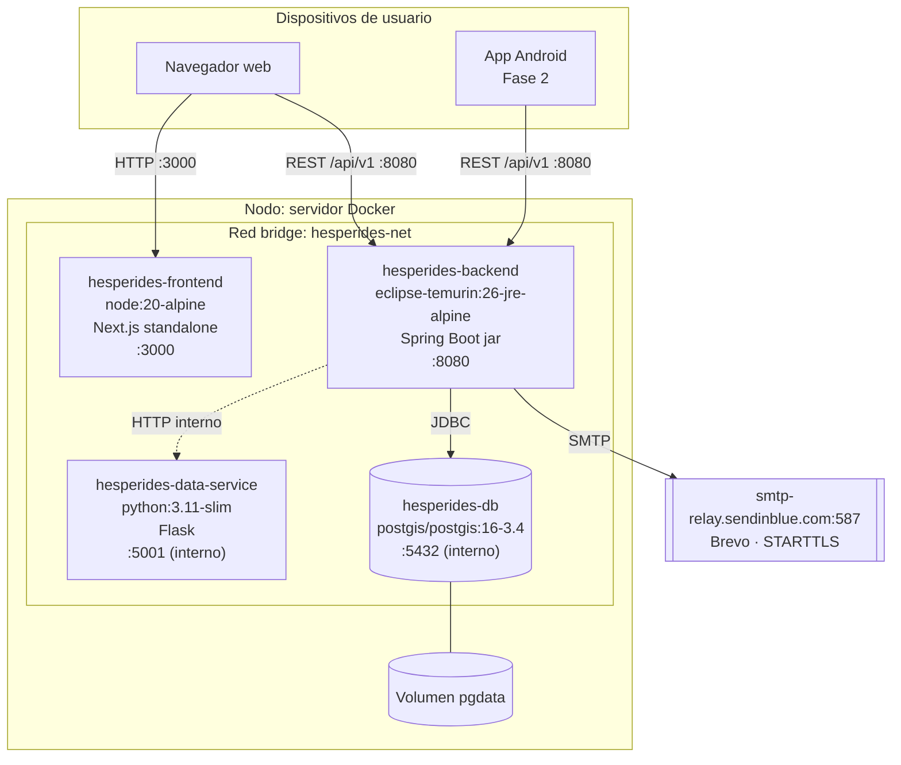
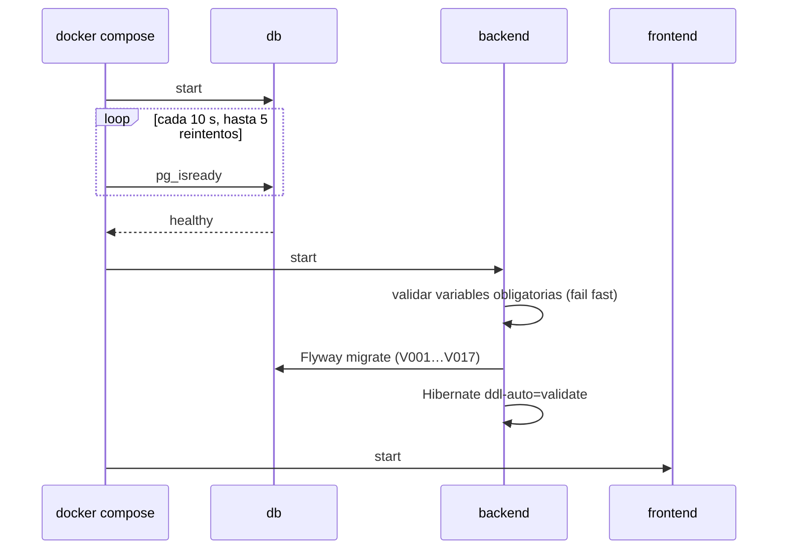
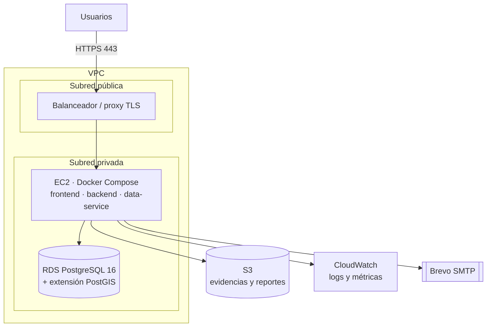

# Modelo de Despliegue (S7)

> **Entregable de la semana 7.** Describe dónde y cómo corre Hesperides: nodos, contenedores,
> red, configuración y el camino hacia producción. Refleja `docker-compose.yml`,
> `docker-compose.dev.yml` y los `Dockerfile` al 1 de octubre de 2026.
>
> **Documentos relacionados:** [Modelo de Análisis y Diseño](../analisis-y-diseno/README.md) ·
> [Modelo de Base de Datos](../base-de-datos/README.md) ·
> [Estándares de codificación y CI/CD](../estandares-y-ci-cd/README.md)

---

## 1. Resumen

Hesperides se despliega como **cuatro contenedores Docker** orquestados con Docker Compose sobre
una red privada `hesperides-net`. El mismo conjunto de imágenes sirve para desarrollo y para
producción; lo que cambia es el archivo de *override* y las variables de entorno.

| Entorno | Estado | Dónde corre |
|---|---|---|
| **Desarrollo local** | ✅ Operativo | Docker Desktop (WSL2) en la máquina de cada integrante |
| **Integración continua** | ✅ Operativo | GitHub Actions (`ubuntu-latest`) |
| **Producción** | ⏳ Pendiente de licencias AWS | Diseño en §6 |

---

## 2. Diagrama de despliegue



El navegador habla **directamente** con el backend (la URL de la API se compila en el bundle
del frontend), por eso CORS es obligatorio: `:3000` y `:8080` son orígenes distintos.

---

## 3. Nodos y contenedores

| Servicio | Contenedor | Imagen base | Puerto | Expuesto al host | Depende de |
|---|---|---|---|---|---|
| `db` | `hesperides-db` | `postgis/postgis:16-3.4` | 5432 | Solo en dev | — |
| `backend` | `hesperides-backend` | build multi-etapa → `eclipse-temurin:26-jre-alpine` | 8080 | Sí | `db` *healthy* |
| `frontend` | `hesperides-frontend` | build multi-etapa → `node:20-alpine` | 3000 | Sí | `backend` |
| `data-service` | `hesperides-data-service` | `python:3.11-slim` | 5001 | Solo en dev | — |

### 3.1 Imágenes

**Backend** — [`backend/Dockerfile`](../../../backend/Dockerfile)

| Etapa | Base | Qué hace |
|---|---|---|
| `build` | `maven:3.9-eclipse-temurin-26` | `dependency:go-offline` (capa cacheable) y `package -DskipTests` |
| runtime | `eclipse-temurin:26-jre-alpine` | Solo el JRE y `app.jar`; usuario sin privilegios `hesperides` |

Los tests no se corren en el build de la imagen porque ya los corre CI (`./mvnw verify`).

**Frontend** — [`frontend/Dockerfile`](../../../frontend/Dockerfile)

| Etapa | Qué hace |
|---|---|
| `deps` | `npm ci` con el lockfile |
| `builder` | Copia `shared/` y `frontend/`, recibe `NEXT_PUBLIC_API_URL` como **build arg** y ejecuta `npm run build` |
| `dev` | `next dev --webpack` con recarga en caliente. Solo la usa el override de desarrollo |
| `runner` | Salida `standalone` de Next + estáticos; usuario `hesperides`; `node server.js` |

> `NEXT_PUBLIC_API_URL` se inlinea en el bundle durante el build. Cambiarla exige
> **reconstruir** la imagen; ponerla como variable de entorno del contenedor no tiene efecto.

**Data service** — [`services/Dockerfile`](../../../services/Dockerfile): una sola etapa,
`pip install --no-cache-dir`, usuario `appuser`, `python -m app.main`.

### 3.2 Red y exposición

- **Compose base:** solo `backend` y `frontend` publican puertos. `db` y `data-service` quedan
  dentro de `hesperides-net`, accesibles por nombre de servicio (`db:5432`,
  `data-service:5001`).
- **Override de desarrollo:** publica también `db` (para DBeaver/psql) y `data-service` (para
  `curl`), y monta el código fuente como volumen.

### 3.3 Persistencia

| Volumen | Montaje | Contenido |
|---|---|---|
| `pgdata` | `/var/lib/postgresql/data` | Datos de PostgreSQL. Sobrevive a `docker compose down`; se borra solo con `down -v` |
| `storage` | `/data/storage` (backend) | Fotos reducidas (1600 px y miniatura). La base solo guarda su clave: **entra en las copias de seguridad junto con `pgdata`** |
| `./inbox` (carpeta del repo) | `/data/inbox` (backend) | Bandeja de carga inicial de fotos de especie (SPEC-104). De escritura: la carga borra cada original al guardarlo. Ignorada por git |

El esquema no vive en el volumen como fuente de verdad: Flyway lo reconstruye desde
`db/migration` al arrancar el backend sobre una base vacía.

### 3.4 Orden de arranque y salud



- `db` tiene `healthcheck` con `pg_isready`; el backend espera a `service_healthy`.
- El backend expone `GET /api/v1/health` y el data service `GET /health`, ambos con el sobre
  `{ok, message, data}`.

---

## 4. Configuración por entorno

Cero credenciales en el código. Todo entra por variables de entorno desde un `.env` que nunca se
versiona; la plantilla es [`.env.example`](../../../.env.example).

### 4.1 Variables obligatorias (el arranque falla si faltan)

| Variable | Por qué no tiene valor por defecto |
|---|---|
| `JWT_SECRET` | Un default firmaría los JWT con una clave conocida. Mínimo 32 caracteres (`openssl rand -base64 48`) |
| `SMTP_FROM` | Un remitente no verificado en Brevo responde 250 y descarta el correo en silencio |
| `APP_PUBLIC_URL` | Va en el enlace del correo de credenciales; un default enviaría a `localhost` |
| `POSTGRES_PASSWORD` | Distinta por entorno |
| `CORS_ALLOWED_ORIGINS` | Depende del dominio del frontend; nunca `*` |
| `NEXT_PUBLIC_API_URL` | Dominio público del backend en cada entorno |

### 4.2 Variables con valor por defecto

| Grupo | Variables |
|---|---|
| PostgreSQL | `POSTGRES_DB`, `POSTGRES_USER`, `POSTGRES_PORT`, `DB_HOST=db`, `DB_PORT=5432` |
| Backend | `BACKEND_PORT=8080`, `SPRING_PROFILES_ACTIVE=dev`, `COOKIE_SECURE=false`, `BACKEND_HEAP=1g` |
| Fotos | `STORAGE_TYPE=local`, `STORAGE_LOCAL_DIR=/data/storage`, `STORAGE_INBOX_DIR=/data/inbox` |
| SMTP | `SMTP_HOST`, `SMTP_PORT=587`, `SMTP_AUTH=true`, `SMTP_STARTTLS=true`, `SMTP_USERNAME`, `SMTP_PASSWORD` |
| Frontend | `FRONTEND_PORT=3000` |
| Data service | `DATA_SERVICE_PORT=5001`, `DATA_SERVICE_URL=http://data-service:5001` |

### 4.3 Memoria del backend y límites de subida (SPEC-104)

El servidor on-premise inicial tiene **2 GB de RAM** y en él corren también PostgreSQL, Next.js y
Flask. Por eso la memoria del backend se fija en el compose con `JAVA_TOOL_OPTIONS: -Xmx1g`
(ajustable con `BACKEND_HEAP`). Sin ella, la JVM toma el 25 % de la RAM —512 MB—, menos de lo que
ocupa una sola importación al límite.

| Límite | Valor | Por qué |
|---|---|---|
| Una foto | 25 MB | Igual en ZIP, formulario y descarga de Drive |
| Una subida (CSV + ZIP) | 250 MB | `spring.servlet.multipart` |
| ZIP descomprimido | 500 MB | El ZIP se descomprime en memoria |
| Importaciones simultáneas | **1** | Una al límite ocupa ~750 MB (250 + 500): con 1 GB de heap cabe una, no dos. La segunda recibe 409 «Hay otra importación en curso» |

**Si el servidor crece**, subir `BACKEND_HEAP` (por ejemplo `2g` en uno de 4 GB). Los límites de
subida no cambian solos: están en `UploadLimits.java`, `application.yml` y `lib/upload-limits.ts`.

### 4.4 Perfiles de Spring

| Perfil | Archivo | Diferencia |
|---|---|---|
| `dev` | `application-dev.yml` | `show-sql: true`, log `DEBUG` del paquete propio, TLS de SMTP relajado |
| `prod` | `application-prod.yml` | `show-sql: false`, log `root: INFO` |

---

## 5. Procedimiento: desarrollo local

```bash
cp .env.example .env            # rellenar JWT_SECRET, SMTP_*, APP_PUBLIC_URL, CORS…
docker compose -f docker-compose.yml -f docker-compose.dev.yml up -d --build
docker compose logs -f backend  # esperar a "Started HesperidesApplication"
```

| Servicio | URL |
|---|---|
| Frontend | http://localhost:3000 |
| API | http://localhost:8080/api/v1 |
| Data service | http://localhost:5001/health |
| PostgreSQL | `localhost:5432` |

Primer ingreso: `admin@pucp.edu.pe` / `Hesperides2026`. El sistema obliga a cambiarla.

**Particularidad de WSL2:** los eventos de archivos de Windows no llegan al contenedor, así que
el frontend de desarrollo usa `WATCHPACK_POLLING=true` y `next dev --webpack` (Turbopack ignora
el sondeo). Los volúmenes anónimos `/app/node_modules` y `/app/.next` evitan que el montaje del
host los tape.

---

### 5.1 Carga inicial de las fotos de especie

Las fotos genéricas de las 90 especies no viajan en el repositorio. Se cargan una vez por
instalación desde la bandeja:

1. Dejar las fotos y su `fotos-especies.csv` en `inbox/species-photos/`. El CSV versionado es
   `docs/dominio/datos/fotos-especies-creditos.csv`: se copia con ese nombre.
2. Con sesión de ADMIN: `POST /api/v1/green-inventory/species-photos/load-inbox`.
3. La respuesta dice cuántas cargó y cuáles fallaron. Cada original guardado se **borra** de la
   bandeja; las fallidas se quedan. Volver a ejecutarlo continúa con lo que quede.
4. Con la bandeja vacía (también se borra el CSV), la carga terminó.

## 6. Producción (diseño objetivo en AWS)

Pendiente de licencias. El diseño mantiene las mismas imágenes y sustituye la base de datos
contenerizada por un servicio gestionado.



| Pieza | Servicio AWS | Nota |
|---|---|---|
| Cómputo | **EC2** | Corre las tres imágenes de aplicación |
| Base de datos | **RDS PostgreSQL** con **PostGIS** habilitado | El catastro usa columnas `GEOMETRY`; sin PostGIS la `V004` detiene el arranque |
| Archivos | **S3** | La BD guarda la clave del objeto; las evidencias se entregan como URL prefirmada de vida corta (SPEC-002 INV-06) |
| Monitoreo | **CloudWatch** | Logs estructurados y métricas |
| TLS | Balanceador o proxy inverso | Requisito para `COOKIE_SECURE=true` |

### 6.1 Checklist antes del primer despliegue real

- [ ] `SPRING_PROFILES_ACTIVE=prod` y `COOKIE_SECURE=true` (sin HTTPS el navegador descarta la cookie de sesión).
- [ ] `JWT_SECRET` y `POSTGRES_PASSWORD` generados y distintos de los de cualquier otro entorno.
- [ ] `CORS_ALLOWED_ORIGINS` con el dominio exacto del frontend.
- [ ] `NEXT_PUBLIC_API_URL` apuntando al dominio público de la API, y la imagen del frontend **reconstruida**.
- [ ] `SMTP_FROM` con un dominio real con SPF y DKIM, verificado en Brevo.
- [ ] Cambiar la contraseña de `admin@pucp.edu.pe` en el primer ingreso (es pública en el repositorio).
- [ ] No publicar el puerto 5432 ni el 5001: usar solo el compose base, sin el override de desarrollo.
- [ ] **Quitar la relajación TLS de SMTP del `application.yml` base.** `mail.smtp.ssl.trust: "*"` y `checkserveridentity: false` están hoy en `application.yml` (commit `815b39d`) además de en `application-dev.yml`, así que producción los hereda. El propio `application-dev.yml` explica que debían vivir solo allí: sin validar el certificado, las credenciales SMTP y las contraseñas temporales viajan cifradas pero hacia quien responda. Con `SMTP_HOST=smtp-relay.sendinblue.com` la validación completa funciona.
- [ ] Copias de seguridad automáticas de RDS activadas.

---

## 7. Dependencias externas en tiempo de ejecución

Solo tres, y ninguna puede bloquear una operación de negocio (REGLAS §0.1):

| Dependencia | Si falla… |
|---|---|
| SMTP (Brevo) | El alta se guarda; la cuenta queda en `PENDING_DELIVERY` y el administrador reenvía. Timeouts de 5 s |
| Publicación en el mapa del cliente | La intervención se guarda; la publicación se reintenta después |
| Servicio de mapas | Las pantallas se degradan a listas y formularios |

**Sobre el host SMTP:** se usa `smtp-relay.sendinblue.com` y no `smtp-relay.brevo.com` porque
el nodo sudamericano de Brevo sirve un certificado que no incluye el nombre nuevo. Mismo
servidor y mismas credenciales.
