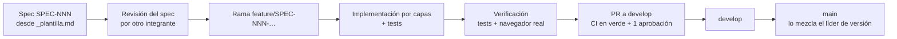
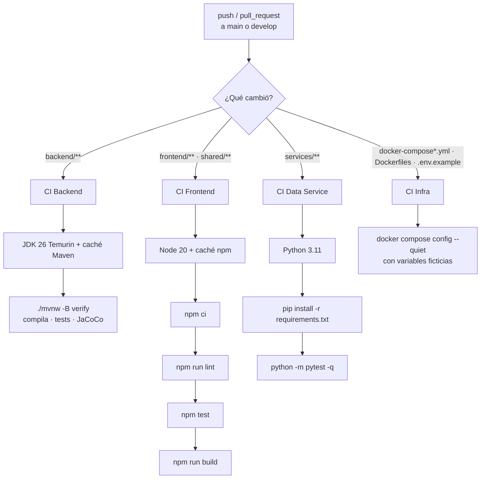
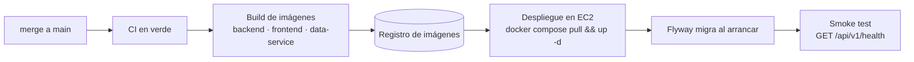

# Estándares de codificación y CI/CD

> **Qué es este documento.** Reúne en un solo lugar las reglas con las que se escribe, revisa e
> integra el código de Hesperides, y describe el pipeline que las hace cumplir. Refleja el
> repositorio al 1 de octubre de 2026.
>
> **Documentos relacionados:** [Modelo de Análisis y Diseño](../analisis-y-diseno/README.md) ·
> [Modelo de Base de Datos](../base-de-datos/README.md) ·
> [Modelo de Despliegue](../despliegue/README.md)
>
> **Fuente de verdad:** [`specs/REGLAS.md`](../../../specs/REGLAS.md). Este documento la resume
> y la ordena; si discrepan, manda `REGLAS.md`.

---

## 1. Proceso de trabajo: Spec Driven Development

Ninguna funcionalidad se programa sin un spec aprobado.

| Paso | Regla |
|---|---|
| Spec | Objetivo en una oración, contratos con tipos exactos, migración SQL definida (o «no necesita tablas»), ≥ 5 criterios de aceptación verificables sin leer código |
| Registro | El estado de cada spec vive en [`specs/REGISTRO.md`](../../../specs/REGISTRO.md); toda enmienda a un spec cerrado se anota allí |
| Verificación | Checklist común de `REGLAS.md` §6 antes de abrir el PR |

---

## 2. Convenciones generales

| Aspecto | Convención |
|---|---|
| Idioma del código | **Inglés**: variables, funciones, clases, identificadores |
| Idioma de specs, documentación y commits | **Español** |
| Ramas | `main` (estable) · `develop` (integración) · `feature/SPEC-NNN-nombre-corto` · `fix/SPEC-NNN-descripcion` · `hotfix/descripcion` |
| Commits | Conventional Commits con alcance: `feat(auth): agrega inicio de sesión` |
| PR | Título `[SPEC-NNN] Descripción corta en español`, mínimo **1 aprobación** de otro integrante |
| Tamaño de archivo | ≤ 200 líneas por archivo de código; si crece, tiene más de una responsabilidad |
| Comentarios | Explican el **por qué**, nunca el qué. Sin código comentado: Git es el historial |
| Configuración | Cero credenciales en el código; variables de entorno con `.env.example` versionado |

### 2.1 Tipos de commit

| Tipo | Uso | Ejemplo |
|---|---|---|
| `feat` | Funcionalidad nueva | `feat(inventory): API de lectura del inventario verde` (`05788dc`) |
| `fix` | Corrección de error | `fix(map): una copia local de un formato anterior ya no rompe el mapa` (`7a24878`) |
| `docs` | Documentación o specs | `docs: registra el inventario verde y renumera las migraciones pendientes` (`8cbb029`) |
| `refactor` | Cambio sin alterar comportamiento | `refactor(db): numera las migraciones de forma cronologica` (`e6bed05`) |
| `test` | Solo tests | `test(backend): cubre casos extremos de validación` |
| `chore` | Mantenimiento, dependencias | `chore: actualiza dependencias` |

---

## 3. Las diez invariantes

Toda feature las cumple; no se re-justifican en cada spec (REGLAS §0).

| # | Invariante |
|---|---|
| INV-1 | Toda respuesta HTTP usa el sobre `{ok, message, data}`, incluido Flask |
| INV-2 | Tipos, estados, roles y categorías son filas de `catalog_items`. Prohibido `enum` de dominio o `@Enumerated` |
| INV-3 | Toda entidad JPA extiende `BaseEntity` sin redeclarar sus campos |
| INV-4 | Soft delete siempre; índices únicos con `WHERE deleted_at IS NULL` |
| INV-5 | La autorización sigue el Anexo A de SPEC-001 |
| INV-6 | La lógica de negocio vive en el Service; el Controller parsea, valida y delega |
| INV-7 | Validación en backend con Bean Validation. Nunca SQL concatenado |
| INV-8 | Los logs nunca llevan contraseñas, hashes ni tokens. Nada de `System.out.println` ni `console.log` de depuración |
| INV-9 | Nada hardcodeado: URLs, credenciales ni «PUCP» en la lógica |
| INV-10 | Toda feature con interfaz web se verifica en un **navegador real** |

---

## 4. Estándares por tecnología

### 4.1 Java / Spring Boot (backend)

| Aspecto | Convención | Ejemplo |
|---|---|---|
| Paquete | `pe.edu.pucp.hesperides.modules.<modulo>.<capa>` | `modules.users.service` |
| Entity | `PascalCase`, sin sufijo | `User`, `GreenElement` |
| DTO | Sufijo `Request` / `Response` | `CreateUserRequest`, `UserDetailResponse` |
| Controller | Sufijo `Controller` | `UsersController` |
| Service | Interfaz + `Impl`, **plural** | `UsersService` / `UsersServiceImpl` |
| Repository | Sufijo `Repository`, **plural** | `UsersRepository` |
| Métodos REST | `getAll`, `getById`, `create`, `update`, `delete`, `search` | |
| Respuesta | `ResponseEntity<ApiResponse<T>>` con status explícito | |
| Errores | Excepciones tipadas + `GlobalExceptionHandler` | `ResourceNotFoundException` → 404 |
| Logs | SLF4J con `@Slf4j` | |
| Engine | `engine/<dominio>`: sin Spring, JPA ni I/O | `engine/frequency`, `engine/proximity` |

**Límites de tamaño por capa:** Controller 100 · Service 150 · Repository 100 · Engine 150 ·
DTO/tipos sin límite · tests sin límite.

**Errores → código HTTP:**

| Excepción | HTTP |
|---|---|
| `ValidationException`, Bean Validation | 400 |
| `UnauthorizedException` | 401 |
| Acceso denegado (`RestAccessDeniedHandler`) | 403 |
| `ResourceNotFoundException`, ruta inexistente | 404 |
| `DuplicateResourceException` | 409 |
| `BusinessRuleException` | 422 |
| `TooManyAttemptsException` | 429 |
| Cualquier otra | 500, sin stack trace al cliente |

> **Spring Boot 4 no es 3.x.** Antes de escribir backend, leer REGLAS §5.2.1: Flyway necesita
> `spring-boot-starter-flyway` (sin él las migraciones no corren y no hay error), Jackson 3 vive
> en `tools.jackson`, `@MockBean` se reemplaza por `@MockitoBean`, y JaCoCo exige 0.8.15+.

### 4.2 TypeScript / Next.js (frontend)

| Aspecto | Convención | Ejemplo |
|---|---|---|
| Componentes | `PascalCase.tsx` | `UserCard.tsx` |
| Props | Interfaz `<Componente>Props` | `UserCardProps` |
| Hooks | `use` + `camelCase` | `useAuth.ts`, `useCatalog.ts` |
| Utilidades | `camelCase.ts` | `formatDate.ts` |
| Llamadas a la API | **Solo** a través de `lib/api.ts` y los `lib/*-api.ts`; nunca `fetch` en un componente | `users-api.ts` |
| Estado | React Context para sesión y catálogos; estado local para UI | |
| Estilos | Tailwind; nunca CSS inline para layouts | |
| Tipos | `strict: true`; sin `any` (usar `unknown`) | |
| Tipos compartidos | `shared/types` (alias `@shared/*`), no se duplican en `frontend/src/types` | |
| Rutas | App Router; las rutas con sesión van en `app/(dashboard)/` | |

### 4.3 Python / Flask (data service)

- App factory en `app/main.py`; rutas como *blueprints* en `app/routes/`; lógica en
  `app/processors/`.
- Toda respuesta usa el mismo sobre `{ok, message, data}`.
- Tests con `pytest` en `app/tests/`.

### 4.4 Base de datos

Resumen; el detalle está en el [Modelo de Base de Datos](../base-de-datos/README.md#2-convenciones-del-esquema).

- Tablas `snake_case` plural, `id BIGSERIAL`, `created_at`/`updated_at`/`deleted_at`.
- FK a catálogo: `<concepto>_item_id`. Índices: `idx_<tabla>_<columnas>`.
- Migraciones Flyway `V<NNN>__<descripcion>.sql`, **cronológicas y sin huecos**; nunca se
  edita una migración publicada.

### 4.5 Docker

- Servicios `backend`, `frontend`, `db`, `data-service`; puertos 8080, 3000, 5432, 5001.
- Imágenes multi-etapa y usuario sin privilegios en runtime.
- `.env` nunca se versiona; `.env.example` sí, sin secretos.

---

## 5. Testing

| Stack | Herramientas | Tipos de test | Comando |
|---|---|---|---|
| Backend | JUnit 5, Mockito, AssertJ, `@WebMvcTest`, Testcontainers 2.x, JaCoCo 0.8.15 | Unitarios de Service y Engine (sin BD) · slices de Controller · integración con PostgreSQL real en contenedor | `./mvnw verify` |
| Frontend | Jest 29, React Testing Library, `user-event`, jsdom | Componentes, hooks y clientes de API (`__tests__/` junto al código) | `npm test` |
| Data service | pytest | Rutas | `python -m pytest` |

**Reglas:**

- Ciclo TDD: test en rojo → implementación mínima → refactor con tests en verde → commit.
- Cada criterio de aceptación del spec tiene al menos un test.
- Cubrir el caso normal, los extremos (vacío, nulo, límites) y los de error.
- El Engine se prueba sin levantar Spring: es la razón de que sea puro.
- **Tests de guarda del proyecto:** `MigrationNumberingTest` falla si una migración rompe la
  numeración cronológica, y `MigrationSmokeTest` aplica todas las migraciones sobre un
  PostgreSQL real (Testcontainers).
- Los tests pasan **antes** de cada commit.
- JaCoCo genera el informe de cobertura en `backend/target/site/jacoco/` durante `verify`.

---

## 6. Integración continua (GitHub Actions)

Cuatro workflows en [`.github/workflows/`](../../../.github/workflows/). Cada uno se dispara en
`push` y `pull_request` hacia `main` o `develop`, **solo si cambian los archivos de su área**
(filtro `paths`), para no gastar minutos de CI en cambios ajenos.

| Workflow | Archivo | Se dispara con cambios en | Pasos |
|---|---|---|---|
| CI Backend | `ci-backend.yml` | `backend/**` | JDK 26 → `./mvnw -B verify` |
| CI Frontend | `ci-frontend.yml` | `frontend/**`, `shared/**` | Node 20 → `npm ci` → `lint` → `test` → `build` |
| CI Data Service | `ci-data-service.yml` | `services/**` | Python 3.11 → `pip install` → `pytest -q` |
| CI Infra | `ci-infra.yml` | `docker-compose*.yml`, los tres `Dockerfile`, `.env.example` | Valida el YAML de Compose |

**Detalles que importan:**

- **La versión de Java en CI sigue al `pom` y al `Dockerfile`.** Con un JDK anterior el
  compilador falla con `release version not supported`; mantenerlas alineadas evita fallos que
  no aparecen en local.
- **El frontend se compila en CI**, no solo se testea: `npm run build` detecta errores de tipos
  y de rutas que Jest no ve.
- **`shared/**` dispara el CI del frontend** porque un cambio de contrato en los tipos
  compartidos puede romperlo.
- **CI Infra usa valores ficticios** para `JWT_SECRET`, `SMTP_FROM` y `APP_PUBLIC_URL`: Compose
  aborta si faltan (`${VAR:?}`), pero aquí solo se valida la sintaxis y nada se levanta.

### 6.1 Requisitos para mezclar un PR

- [ ] Todos los workflows afectados en verde.
- [ ] Al menos una aprobación de otro integrante.
- [ ] Checklist de `REGLAS.md` §6.2 revisado (estructura, invariantes, calidad).
- [ ] Si toca la interfaz web: probado en navegador real, sin `OPTIONS` con 401 ni errores de
      CORS en la consola (INV-10).

---

## 7. Entrega continua (CD)

| Etapa | Estado |
|---|---|
| Build de imágenes Docker | ✅ Reproducible localmente con `docker compose build` |
| Validación de la orquestación | ✅ Automática (CI Infra) |
| Publicación de imágenes en un registro | ⏳ Pendiente |
| Despliegue automático a un entorno | ⏳ Pendiente de licencias AWS |

**Flujo previsto** una vez disponibles las licencias:

Las migraciones no se aplican en un paso aparte: Flyway las ejecuta al arrancar el backend, y si
una falla el contenedor no arranca (fail fast). Los secretos de producción se inyectan desde el
gestor de secretos del entorno, nunca desde el repositorio.

---

## 8. Seguridad en el código

| Regla | Aplicación |
|---|---|
| Secretos | Solo por variables de entorno; el arranque falla si falta uno obligatorio |
| SQL | JPA o parámetros; nunca concatenación |
| CORS | Lista cerrada de orígenes, `allowCredentials: true`, preflight `OPTIONS` público; nunca `*` |
| Sesión web | Refresh token en cookie `httpOnly`, `Secure`, `SameSite=Strict`, `Path=/api/v1/auth` |
| Contraseñas | BCrypt; cambio obligatorio tras una contraseña temporal |
| Errores | Mensajes claros para el usuario, sin detalles internos ni stack traces |
| Dependencias | No se añaden librerías no autorizadas por el spec; las versiones vulnerables se actualizan (Next 14 → 16 por un bypass de autorización con CVSS 9.1) |
